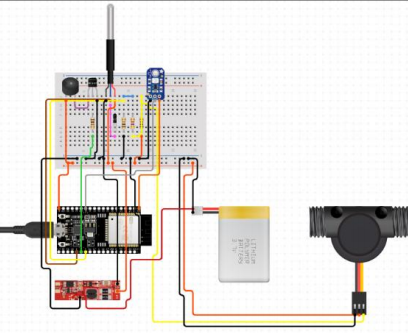
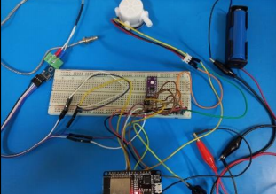

# Nuclear Reactor IoT Monitoring System

An **ESP32-based real-time safety monitoring prototype** designed to simulate critical nuclear reactor parameters, including **core temperature**, **coolant water flow rate**, and **UV radiation leakage**.

The system collects live sensor readings, transmits them over **Wi-Fi**, and visualizes them on **cloud dashboards** using **Firebase** and **Adafruit IO**, while triggering safety alerts under abnormal operating conditions.

---

## Project Overview

This project was developed as part of an engineering prototype focused on improving safety monitoring in high-risk industrial environments.

The system continuously tracks three critical parameters:

- **Core Temperature** using **MAX6675 thermocouple**
- **Coolant Water Flow Rate** using **YF-S401 flow sensor**
- **UV Radiation Leakage** using **GUVA-S12SD sensor**

A buzzer-based alert mechanism is activated when temperature approaches critical thresholds.

---

## System Workflow

Sensors → ESP32 → Wi-Fi → Firebase / Adafruit IO → Dashboard → Safety Alert

---

## Key Features

- Real-time sensor monitoring
- Wi-Fi cloud connectivity
- Live dashboard visualization
- Threshold-based emergency alerting
- Embedded systems integration
- Modular sensor architecture

---

## Hardware Components

- ESP32
- MAX6675 thermocouple
- YF-S401 water flow sensor
- GUVA-S12SD UV sensor
- buzzer
- external battery supply
- potentiometer-controlled water pump

---

## Circuit Diagram



---

## Prototype Setup



---

## Technologies Used

- **C++**
- **Arduino IDE**
- **ESP32**
- **Firebase Realtime Database**
- **Adafruit IO**
- **MQTT**
- **Wi-Fi communication**
- **Embedded systems**

---

## Applications

This prototype demonstrates how IoT can be applied in:

- industrial safety systems
- predictive monitoring
- high-risk infrastructure environments
- smart energy systems
- remote diagnostics

---

## Future Improvements

- predictive anomaly detection
- automated threshold calibration
- mobile dashboard
- historical analytics
- machine learning based fault prediction

---

## Repository Structure

```text
src/        → ESP32 source code
diagrams/   → circuit and prototype images
docs/       → project documentation and poster
